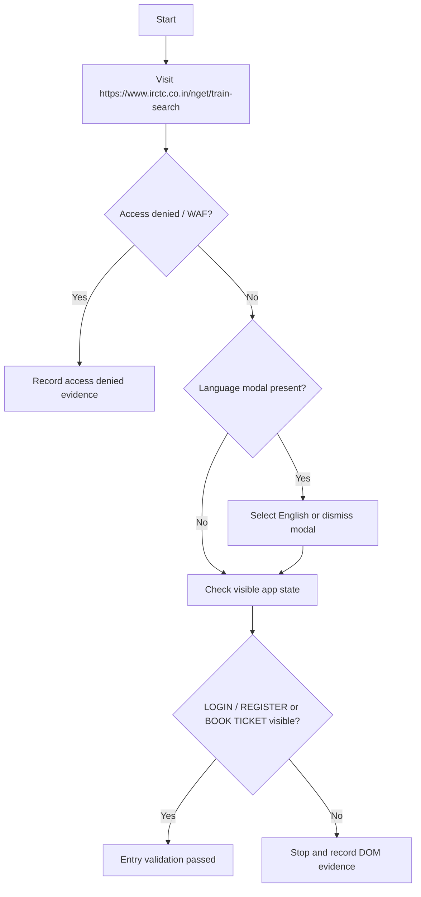
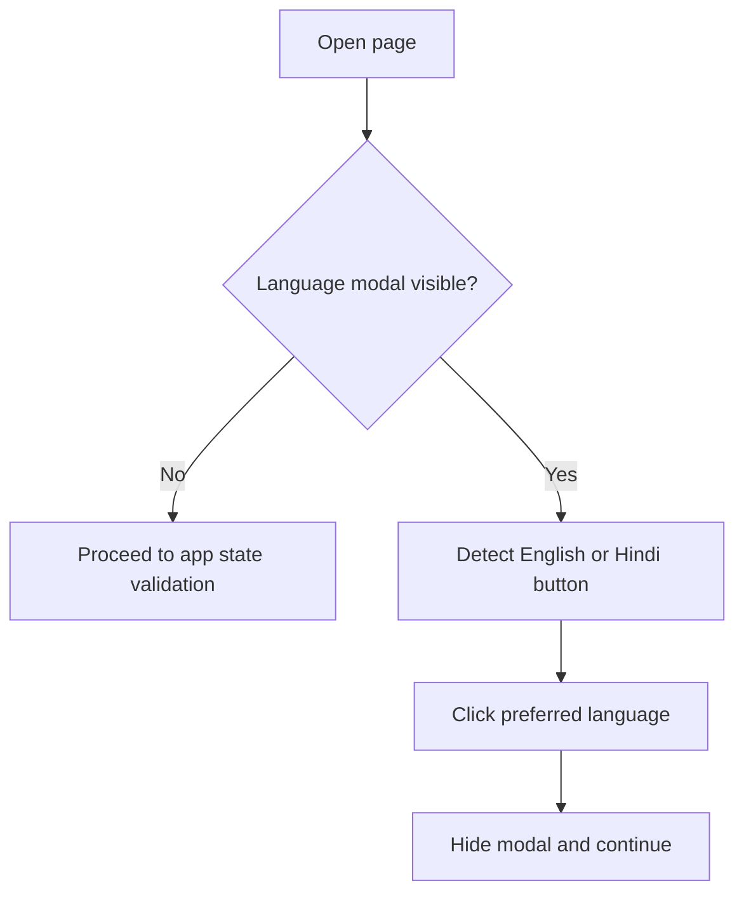
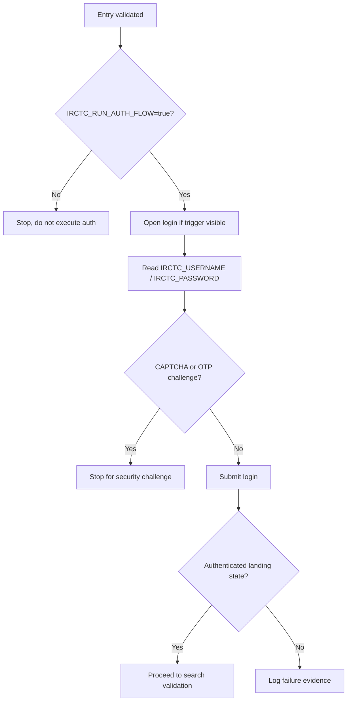
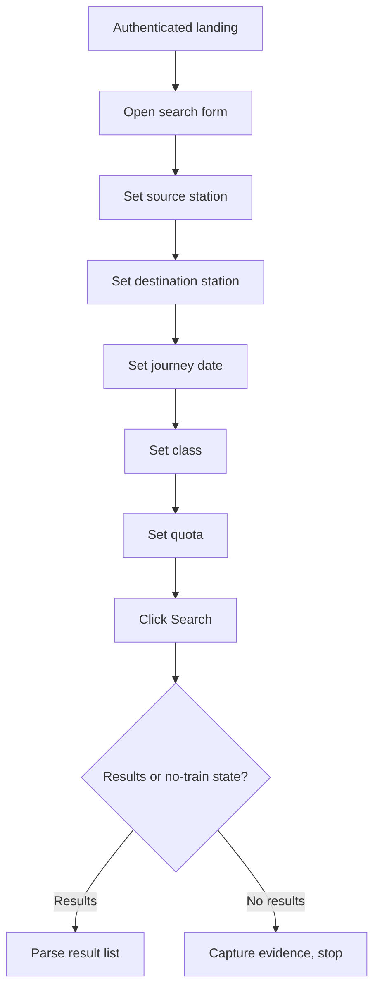
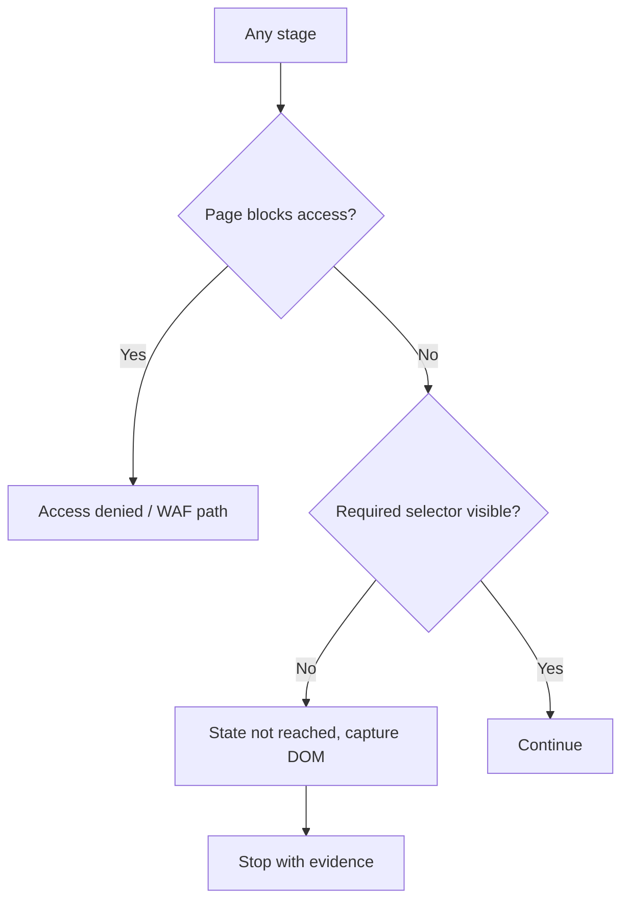
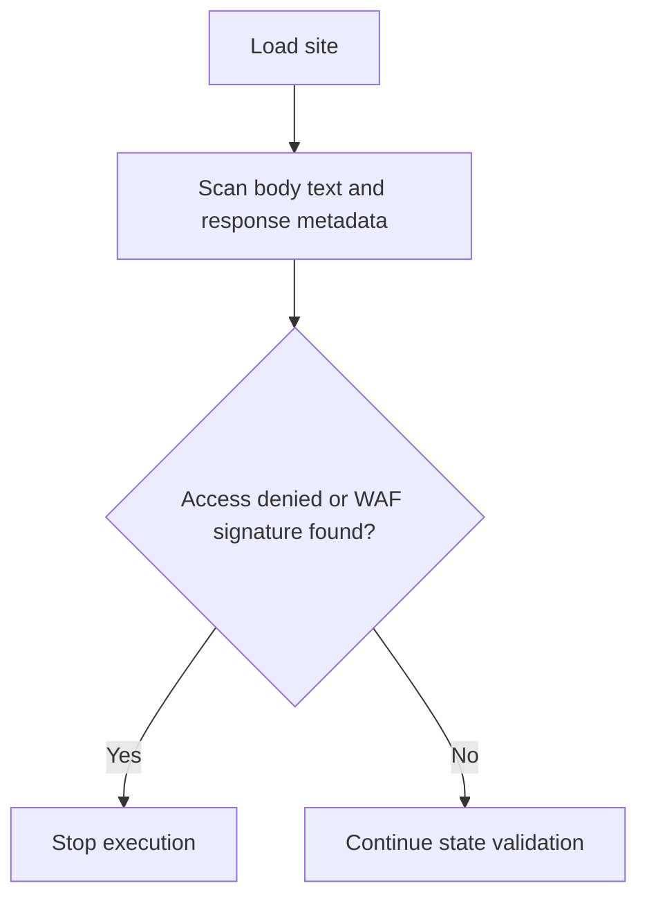
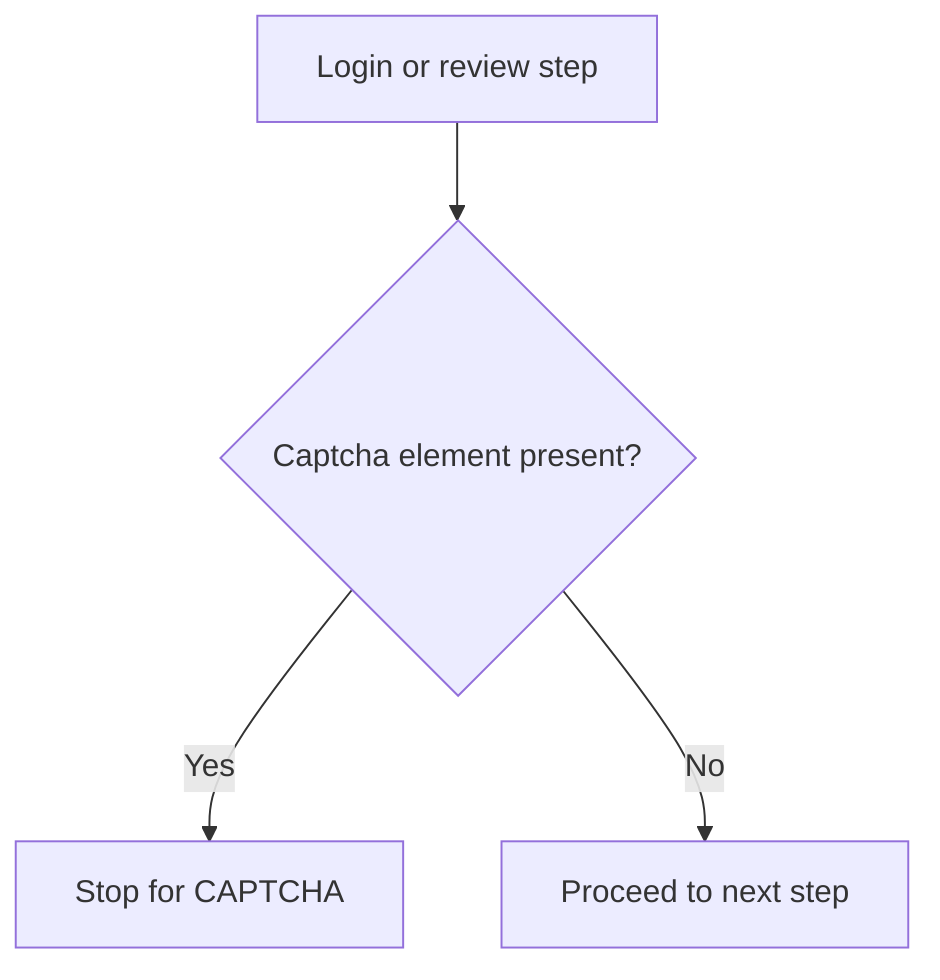
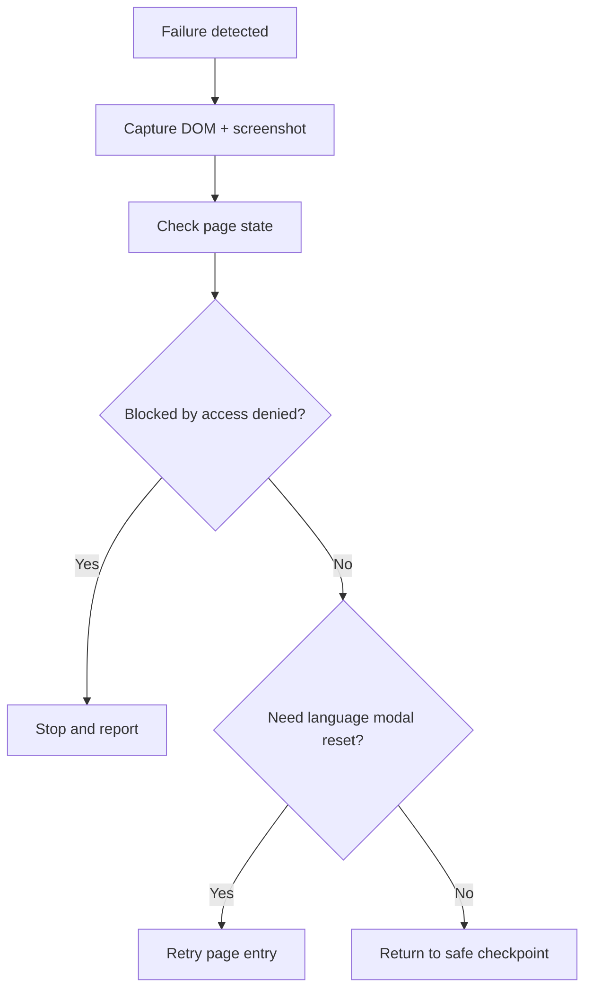
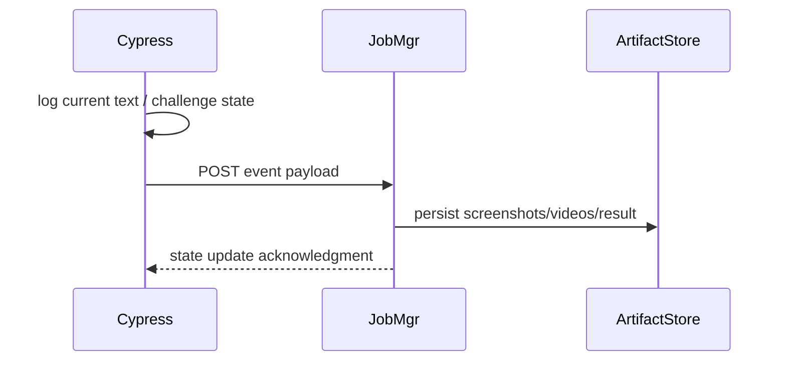

# Application Flows

Status: VERIFIED for observed site behavior; PARTIAL for later booking phases.

## 1. Entry Flow

### Purpose

Establish routability to the IRCTC search page and assert the entry UI state without assuming auth or booking completion.

### Evidence

- README and Cypress specs use `/nget/train-search` as the only validated route.
- Language modal and button text are specifically referenced in README and logs.

## 2. Language Selection Flow

### Purpose

Handle the welcome-language choice before continuing to login or booking state.

### Evidence

- README confirms `Hindi` and `English` buttons are visible.
- `cypress/e2e/irctc-entry.cy.js` calls `cy.dismissLanguageChoiceIfPresent()`.

Status: VERIFIED.

## 3. Authentication Flow

### Purpose

Provide a guarded login path only when environment credentials are supplied and auth is explicitly enabled.

### Evidence

- README: “Authentication flow disabled by default.”
- `irctc-login.cy.js` includes guard logic.
- `CredentialManager.js` uses env variables first.

Status: PARTIAL for live validation; VERIFIED for code presence.

## 4. Search Flow

### Purpose

Populate the train search form and validate the search UI state after auth is established.

### Evidence

- `commands.js` contains `doPostLoginFlow` with source, destination, date, quota, and search automation.
- Yet the repository explicitly says downstream search DOM is not yet verified in the current live environment.

Status: PARTIAL.

## 5. Error Flow

### Purpose

Recognize access-denied, login failure, and missing-state conditions without assuming progress.

### Evidence

- README clearly separates access-denied/WAF from selector failure.
- Logs in `.data/jobs.json` show a failed run after language modal dismissal and login wait, with no validated auth state.

Status: VERIFIED.

## 6. Access Denied Flow

### Purpose

Detect and classify IRCTC blocks before any deeper automation.

### Evidence

- README explicitly notes access-denied/WAF detection.
- Cypress config includes browser launch tweaks to reduce fingerprinting and blocking.

Status: VERIFIED.

## 7. CAPTCHA Detection Flow

### Purpose

Prevent automation when a CAPTCHA challenge is present.

### Evidence

- `README.md` states: “Makes CAPTCHA handling conditional and stops rather than attempting to solve or bypass it.”
- `commands.js` contains `submitCaptcha` and `solveCaptcha` helper logic, but the repository’s active path intentionally does not execute them as a live production flow.

Status: VERIFIED for stop-policy; PARTIAL for solver implementation.

## 8. Recovery Flow

### Purpose

When a state fails, capture evidence and restart from a safe boundary.

### Evidence

- Screenshot capture is configured in `cypress.config.js`.
- Job artifacts in `artifacts/jobs` are created to capture results.

Status: PARTIAL.

## 9. Diagnostics Flow

### Purpose

Expose state and request details for forensic investigation.

### Evidence

- `cypress.config.js` uses a `task('log')` handler to emit job events.
- `src/server/index.js` receives `/jobs/:id/events` and stores aggregated logs.

Status: VERIFIED.

## 10. Architectural interpretation

The codebase currently represents a conservative flow model:

- entry validation,
- language handling,
- auth gating,
- challenge detection,
- stop-and-evidence logic.

This is a proper control boundary for a site that actively blocks automation and requires human intervention on security gates.
