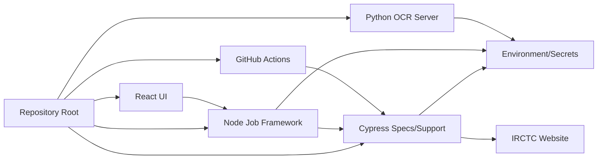
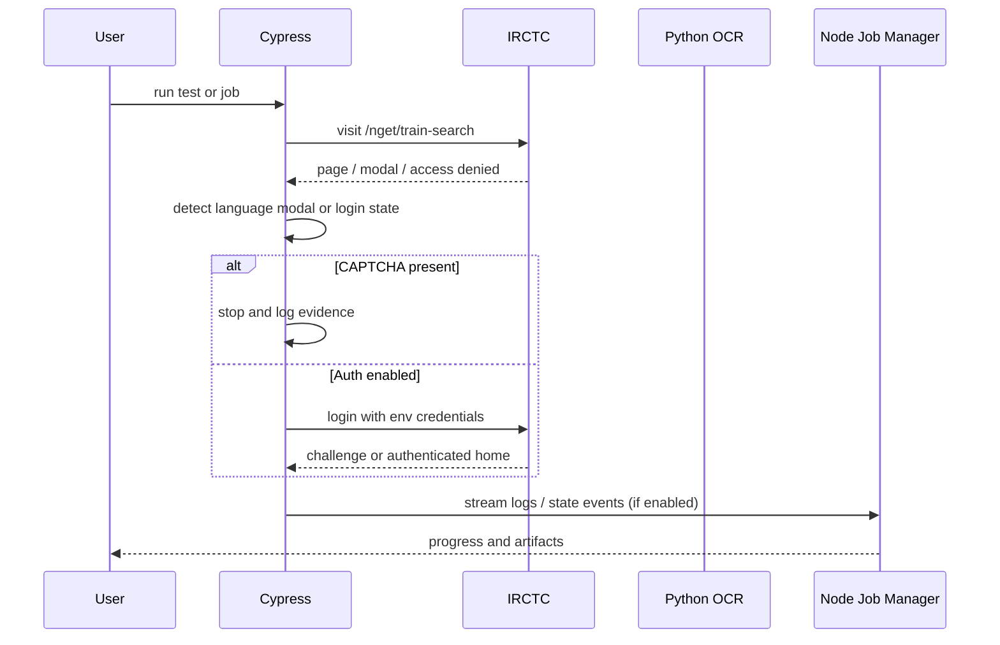

# Repository Analysis

Status: VERIFIED

## 1. Repository overview

This repository is a Cypress-based IRCTC automation project with a supporting Python OCR service and a Node.js job-manager layer. The project currently defines a narrow, evidence-first validation baseline rather than a full booking automation pipeline.

The clearest repository evidence is as follows:

- The main README states that the suite intentionally validates only `/nget/train-search` and then stops on CAPTCHA, OTP, eligibility, and payment states.
- `MIGRATION.md` explicitly excludes OCR CAPTCHA solving, payment automation, and stale booking logic from active execution.
- The current Cypress specs focus on entry-state detection and guarded login flow only when `IRCTC_RUN_AUTH_FLOW=true`.
- The Node server and UI introduce a future job orchestration model but are not yet the primary runtime of the validated scope.

## 2. Module inventory

### Root-level files

- `package.json`: Node project manifest, scripts, dependencies.
- `cypress.config.js`: Cypress runtime config and custom task logging.
- `.gitignore`: repository-level ignore rules for secrets, artifacts, and generated output.
- `README.md`: project baseline narrative and current limits.
- `MIGRATION.md`: source migration and exclusion policy.
- `.github/workflows/irctc.yml`: GitHub Actions CI workflow for a Chrome-headed booking run.
- `irctc-captcha-solver/`: Python EasyOCR service used for optional CAPTCHA decoding.

### Cypress modules

- `cypress/e2e/irctc-entry.cy.js`: verifies entry page and access-state detection.
- `cypress/e2e/irctc-login.cy.js`: guarded auth flow, disabled by default.
- `cypress/e2e/irctc-train-search.cy.js`: search flow after authenticated state.
- `cypress/e2e/irctc-booking-flow.cy.js`: full booking flow path intentionally stops at payment.
- `cypress/e2e/irctc.cy.js`: legacy monolithic flow with numerous DOM assumptions and direct automation logic.
- `cypress/support/commands.js`: custom Cypress commands including login, CAPTCHA detection, and booking flow helpers.
- `cypress/support/configLoader.js`: loads booking request config from an env object or fixtures.
- `cypress/support/e2e.js`: loads support helpers.
- `cypress/fixtures/booking.json`: example journey payload.
- `cypress/fixtures/booking.example.json`: sanitized example record.
- `cypress/fixtures/passenger_data.json`: legacy dataset for booking automation.

### Source runtime modules

- `src/server/index.js`: Express job manager API.
- `src/models/Job.js`: job lifecycle state machine.
- `src/models/BookingRequest.js`: request validation/normalization.
- `src/security/CredentialManager.js`: credential retrieval abstraction.
- `src/persistence/JobStore.js`: JSON-based persistence model.
- `src/scheduler/Scheduler.js`: scheduling/execution logic.
- `src/engine/adapter.js`: Cypress launcher for a booking job.

### UI modules

- `ui/src/App.jsx`: React front-end for desktop automation management.
- `ui/src/components/*`: tabbed UI for accounts, journeys, jobs, and automation controls.
- `ui/package.json`: UI toolchain.

## 3. Purpose of each module

### `cypress/e2e/*`

These specs represent the user-facing automation flow. The repository currently contains both a narrow safety gate and a legacy booking script. The safe baseline is centered on entry validation and auth gating, while the legacy booking script is present for migration reference but not accepted as active operational automation.

### `cypress/support/commands.js`

This is the largest implementation file. It contains custom commands for:

- login flow handling,
- CAPTCHA detection,
- post-login search,
- train selection,
- passenger entry,
- payment boundary logic,
- and retry loops.

This file is also the highest-risk area because it contains logic that crosses security boundaries and depends on a dynamic DOM.

### `cypress/support/configLoader.js`

This file bridges a modern job/request model with older Cypress constants. It reads `BOOKING_REQUEST` first and falls back to legacy fixture data. This is a compatibility adapter, not a stable domain boundary.

### `src/server/index.js`

This is a job orchestration API exposing `/jobs`, `/jobs/:id`, and `/credentials`, with event ingestion for Cypress logs.

### `src/models/*`

These define the domain model for booking requests, job execution state, and validation rules. The data model is more complete than the current live automation coverage.

### `irctc-captcha-solver/*`

The Python service provides OCR for CAPTCHA solving, but the project explicitly stops before acting on CAPTCHA in the proven baseline. This service remains a hidden implementation capability rather than a validated current workflow.

## 4. Dependency map

### Dependency relationships

- Cypress depends on the browser runtime and site DOM behavior.
- The Node job framework depends on Cypress as the browser automation engine.
- The UI depends on the server endpoints and local storage for job orchestration.
- OCR is a standalone Python service that can be run independently.
- Environment variables and secret management are required by both CI and local execution.

## 5. Runtime flow

Status: VERIFIED for entry-state validation; PARTIAL for job manager and advanced booking flow.

### Current baseline runtime flow

1. Cypress loads the site at `/nget/train-search`.
2. It checks for a language selection modal.
3. It reports whether it is blocked by access denial or WAF.
4. It validates whether the page is in an entry state, login state, or authenticated state.
5. It stops before CAPTCHA or OTP automation.
6. It optionally opens the login route only when the env flag is enabled.

### Job-manager runtime flow

1. UI posts a booking request to `/jobs`.
2. Server validates the payload using `BookingRequest.js`.
3. Scheduler resolves credentials and calls the engine adapter.
4. Adapter launches Cypress with a browser and a fixture snapshot.
5. Cypress logs progress to the job manager state stream.
6. An artifact directory stores screenshots and the job result.

## 6. Build flow

Status: VERIFIED

The repository build flow is simple:

- `npm install` installs Cypress, Express, and related Node dependencies.
- `python -m pip install -r irctc-captcha-solver/requirements.txt` installs OCR dependencies.
- `npx cypress run ...` executes browser tests.
- `npm run start-ui` launches the redirecting runner stack for the React UI and job manager.

The build flow is intentionally dependent on a real browser environment and not independent of the target website behavior.

## 7. Execution flow

Status: VERIFIED for entry flow; PARTIAL for downstream flows.

## 8. Configuration flow

Status: VERIFIED

Configuration is split across:

- `cypress.config.js` for runtime browser settings and log task emission.
- environment variables for credentials and feature toggles.
- fixture JSON files for example booking payloads.
- UI state where user-defined journeys are stored in local storage.

Important evidence: credentials are not committed to source control, and the project explicitly documents that auth is disabled unless `IRCTC_RUN_AUTH_FLOW=true` is supplied.

## 9. Architectural conclusion

The repository is best described as a hybrid system:

- a real browser automation project with evidence-first validation,
- a job orchestration and UI layer for future automation,
- and a legacy booking automation codebase retained for migration reference.

This hybrid state is valuable but creates ambiguity unless the team clearly separates verified baseline automation from legacy unsupported automation.

## 10. Key findings

- VERIFIED: entry route and page-state validation exist.
- VERIFIED: language modal detection exists.
- VERIFIED: WAF/access-denied detection exists.
- VERIFIED: security guardrails exist for CAPTCHA and OTP states.
- PARTIAL: full login flow exists but is gated and not proven in the current environment.
- PARTIAL: search journey orchestration exists in code but not fully validated against current live DOM.
- ASSUMED: downstream booking automation is move-ready without revalidation.
- UNKNOWN: current runtime around actual live DOM beyond entry-state observation.
