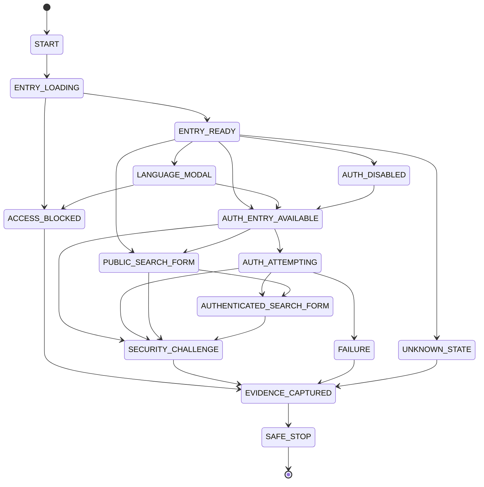

# State Machine Documentation

Status: IMPLEMENTATION-READY for MVP-1 baseline.

## 1. Canonical state model for MVP-1

## 2. State definitions

### START

- Meaning: Initial state before any browser action.
- Entry criteria: Process starts from the Cypress test file or job-adapter entry point.
- Exit criteria: browser begins page load.
- Allowed actions: initialize logs, environment checks, start browser.
- Forbidden actions: any interaction with login, booking, or payment controls.
- Evidence requirements: none beyond run metadata.
- Timeout behavior: no page wait before first navigation.
- Recovery behavior: abort if the browser runtime cannot start.
- Current validation status: CODE_VERIFIED in [cypress.config.js](../cypress.config.js#L13-L63) and [package.json](../package.json#L1-L28).

### ENTRY_LOADING

- Meaning: The browser is navigating to the IRCTC train-search route.
- Entry criteria: test invokes `cy.visit` or `window.location.href` to `/nget/train-search` as in [cypress/e2e/irctc-entry.cy.js](../cypress/e2e/irctc-entry.cy.js#L1-L24) and [cypress/e2e/irctc.cy.js](../cypress/e2e/irctc.cy.js#L30-L38).
- Exit criteria: page either loads and shows the entry state or returns an access-denied/WAF response.
- Allowed actions: basic route load, response capture, evidence logging.
- Forbidden actions: login submission, booking, payment submission, OCR attempts.
- Evidence requirements: page load status, screenshot, body text summary.
- Timeout behavior: treat unreachable or blocked route as `ACCESS_BLOCKED` or `FAILURE`.
- Recovery behavior: stop and capture evidence; do not continue deeper.
- Current validation status: CODE_VERIFIED, with the repository explicitly marking this as the safe baseline in [README.md](../README.md#L5-L19).

### ENTRY_READY

- Meaning: The page has loaded and the site presents a valid booking entry surface or a visible login/register boundary.
- Entry criteria: body text contains live entry signals such as `LOGIN / REGISTER` or `BOOK TICKET` rather than stale selector assumptions.
- Exit criteria: either a language modal appears, an auth trigger is available, or the page is classified as blocked or unknown.
- Allowed actions: page state detection, modal dismissal handling, auth gating.
- Forbidden actions: any attempt to manipulate payment or booking forms.
- Evidence requirements: DOM text snapshot or screenshot.
- Timeout behavior: fail if no state is visible within a bounded wait.
- Recovery behavior: classify as `UNKNOWN_STATE` and capture evidence.
- Current validation status: CODE_VERIFIED in [cypress/e2e/irctc-entry.cy.js](../cypress/e2e/irctc-entry.cy.js#L1-L24).

### LANGUAGE_MODAL

- Meaning: The observed language-selection modal is active.
- Entry criteria: realtime DOM text includes Hindi/English options or a modal overlay is visible.
- Exit criteria: language button is clicked or modal is dismissed and page continues.
- Allowed actions: detect and dismiss the modal without deeper automation.
- Forbidden actions: clicking anything beyond the modal selection or continuing into login if the route is blocked.
- Evidence requirements: screenshot and text of language choice.
- Timeout behavior: if the modal stays active too long, treat as `UNKNOWN_STATE` or `FAILURE`.
- Recovery behavior: stop and capture evidence if the modal cannot be resolved.
- Current validation status: CODE_VERIFIED in [README.md](../README.md#L12-L18) and [cypress/e2e/irctc-entry.cy.js](../cypress/e2e/irctc-entry.cy.js#L1-L24).

### ACCESS_BLOCKED

- Meaning: The site has blocked or filtered the request; this is not a recoverable automation path in the MVP-1 design.
- Entry criteria: access-denied/WAF signatures, repeated blocks, or a non-booking page state.
- Exit criteria: site reports blocked state and the test exits with evidence.
- Allowed actions: state classification, recording the block, and stopping.
- Forbidden actions: retries designed to bypass WAF, rate limits, or bot protections.
- Evidence requirements: screenshot, failed run logs, body text summary.
- Timeout behavior: immediate stop once block is identified.
- Recovery behavior: no bypass; transition to `EVIDENCE_CAPTURED` then `SAFE_STOP`.
- Current validation status: CODE_VERIFIED in [README.md](../README.md#L7-L9) and [cypress.config.js](../cypress.config.js#L13-L63).

### AUTH_DISABLED

- Meaning: the system is intentionally not running auth automation.
- Entry criteria: `IRCTC_RUN_AUTH_FLOW` is false or unset.
- Exit criteria: auth actions are skipped, and the system remains in a safe validation state.
- Allowed actions: report auth disabled and continue entry validation only.
- Forbidden actions: credential submission or login click attempts.
- Evidence requirements: env flag presence and safe stop reason.
- Timeout behavior: immediate skip.
- Recovery behavior: safe continue only with explicit opt-in.
- Current validation status: CODE_VERIFIED in [cypress/e2e/irctc-entry.cy.js](../cypress/e2e/irctc-entry.cy.js#L7-L15) and [cypress/e2e/irctc-login.cy.js](../cypress/e2e/irctc-login.cy.js#L8-L15).

### AUTH_ENTRY_AVAILABLE

- Meaning: a visible auth trigger or login/register affordance is present.
- Entry criteria: page is in a valid entry or login boundary and the UI exposes an auth option.
- Exit criteria: user chooses to either attempt auth or remain in a non-auth state.
- Allowed actions: open login surface, inspect login fields, stop on challenge.
- Forbidden actions: submit credentials unless explicit auth mode is active and environment is valid.
- Evidence requirements: page-body text evidence and screenshot.
- Timeout behavior: fail if no login trigger becomes visible.
- Recovery behavior: go to `SECURITY_CHALLENGE` or `SAFE_STOP` if the UI is ambiguous.
- Current validation status: PARTIAL, because the code exists but the live DOM must be revalidated before expanding beyond entry checks.

### AUTH_ATTEMPTING

- Meaning: login flow is active under an explicit opt-in guard.
- Entry criteria: `IRCTC_RUN_AUTH_FLOW=true` and credentials are available.
- Exit criteria: either auth succeeds to a known landing state, a challenge appears, or a failure is recorded.
- Allowed actions: login field interactions and state checks only.
- Forbidden actions: CAPTCHA solving, OTP automation, payment attempts, or deeper booking actions.
- Evidence requirements: screenshot and logs for every submit result.
- Timeout behavior: challenge or timeout transitions to `SECURITY_CHALLENGE` or `FAILURE`.
- Recovery behavior: stop and capture evidence; no bypass is allowed.
- Current validation status: PARTIAL in [cypress/e2e/irctc-login.cy.js](../cypress/e2e/irctc-login.cy.js#L29-L48) and [src/security/CredentialManager.js](../src/security/CredentialManager.js#L1-L41).

### SECURITY_CHALLENGE

- Meaning: CAPTCHA, OTP, or another anti-automation challenge is visible.
- Entry criteria: login, review, or next-stage page shows `captcha`, `otp`, or equivalent challenge markers.
- Exit criteria: challenge is classified and the automation stops.
- Allowed actions: log the challenge and capture evidence.
- Forbidden actions: CAPTCHA solving, OTP entry, or payment execution.
- Evidence requirements: screenshot, page text, and challenge metadata.
- Timeout behavior: hard stop once challenge is recognized.
- Recovery behavior: jump to `EVIDENCE_CAPTURED` and `SAFE_STOP`.
- Current validation status: CODE_VERIFIED in [README.md](../README.md#L11-L19) and [cypress/support/commands.js](../cypress/support/commands.js#L38-L59).

### PUBLIC_SEARCH_FORM

- Meaning: a public search UI is available without requiring the system to assume auth.
- Entry criteria: the page loads a search form or route controls in a public state without proving auth.
- Exit criteria: the form is either validated as a public state or it is reclassified as an auth-dependent state after additional evidence.
- Allowed actions: route and state validation only; no booking or submission.
- Forbidden actions: any search completion that crosses challenge boundaries or attempts booking automation.
- Evidence requirements: screenshot and visible field checks, if the form is reached.
- Timeout behavior: treat as `UNKNOWN_STATE` if the route cannot be validated.
- Recovery behavior: stop at the safe boundary rather than assuming auth is required.
- Current validation status: PARTIAL, because the implementation permits a public-state concept but the repository does not currently prove a live public search flow beyond entry validation.

### AUTHENTICATED_SEARCH_FORM

- Meaning: a search form that is only valid after the authenticated state is observed.
- Entry criteria: login or authenticated landing state is clearly visible before search controls are used.
- Exit criteria: search controls are validated or challenge status occurs.
- Allowed actions: state validation only while leaving the rest of the booking flow out of scope.
- Forbidden actions: passenger fill, ticket booking, upi, or payment.
- Evidence requirements: authenticated-state evidence and form visibility.
- Timeout behavior: stop once the auth state is not present or challenge appears.
- Recovery behavior: escalate to `SECURITY_CHALLENGE` or `SAFE_STOP`.
- Current validation status: PARTIAL in [cypress/e2e/irctc-train-search.cy.js](../cypress/e2e/irctc-train-search.cy.js#L13-L44).

### UNKNOWN_STATE

- Meaning: the page cannot be safely classified into any allowed state.
- Entry criteria: unexpected DOM, hidden overlays, route mismatch, or ambiguous body text.
- Exit criteria: capture evidence and move to a safe stop.
- Allowed actions: logging only.
- Forbidden actions: interaction with forms, payment, or security challenge fields.
- Evidence requirements: screenshot and body-text capture.
- Timeout behavior: failure after a bounded wait.
- Recovery behavior: move to `EVIDENCE_CAPTURED` and `SAFE_STOP`.
- Current validation status: PARTIAL, because the repo describes classification logic but does not yet implement a formal unknown-state contract beyond route checks.

### EVIDENCE_CAPTURED

- Meaning: the run has captured enough forensic evidence to explain the state and stop safely.
- Entry criteria: a route block, challenge, or unexpected state is identified.
- Exit criteria: the system records and returns a safe-stop result.
- Allowed actions: screenshot, log event, state metadata capture, and exit.
- Forbidden actions: continuing to deeper booking steps.
- Evidence requirements: screenshot, body text, run metadata, and reason classification.
- Timeout behavior: immediate when state is classified as blocked or challenged.
- Recovery behavior: same run ends in `SAFE_STOP`.
- Current validation status: CODE_VERIFIED in [cypress.config.js](../cypress.config.js#L16-L49) and [src/server/index.js](../src/server/index.js#L24-L54).

### SAFE_STOP

- Meaning: the system exits without crossing any security or financial boundary.
- Entry criteria: the run reached a known blocked/unsafe state or completed an allowed inspection state.
- Exit criteria: no deeper interaction occurs.
- Allowed actions: report issue and keep recorded evidence.
- Forbidden actions: CAPTCHA solving, booking, OTP entry, UPI, or payment.
- Evidence requirements: final run status and evidence bundle.
- Timeout behavior: no further wait after a challenge or block is recognized.
- Recovery behavior: if a future validation step is needed, it must start from the safe baseline again.
- Current validation status: CODE_VERIFIED by design in [README.md](../README.md#L5-L19) and [MIGRATION.md](../MIGRATION.md#L1-L18).

### FAILURE

- Meaning: the run is not safely recoverable under the MVP-1 contract.
- Entry criteria: a required state is missing, a route fails unexpectedly, or a challenge state is encountered without evidence capture.
- Exit criteria: transition to evidence capture and stop.
- Allowed actions: logging and evidence recording.
- Forbidden actions: any attempt to continue deeper or to bypass the protection barrier.
- Evidence requirements: screenshot, route status, reason, and terminal status.
- Timeout behavior: fail fast once the root cause is verified.
- Recovery behavior: do not retry the same blocked or challenged flow without a new validation plan.
- Current validation status: CODE_VERIFIED in the job-manager error paths in [src/server/index.js](../src/server/index.js#L24-L54) and [src/scheduler/Scheduler.js](../src/scheduler/Scheduler.js#L18-L65).

## 3. Canonical validation principle

The implementation must not assume that search requires authentication. In this MVP-1 model, the repository is validating a public entry route and a guarded auth path separately, with all deeper flows excluded. The project is intentionally bounded by the rule: stop on CAPTCHA, OTP, or any payment boundary.

## 4. Current validation summary

| State | Validation status |
| --- | --- |
| START | CODE_VERIFIED |
| ENTRY_LOADING | CODE_VERIFIED |
| ENTRY_READY | CODE_VERIFIED |
| LANGUAGE_MODAL | CODE_VERIFIED |
| ACCESS_BLOCKED | CODE_VERIFIED |
| AUTH_DISABLED | CODE_VERIFIED |
| AUTH_ENTRY_AVAILABLE | PARTIAL |
| AUTH_ATTEMPTING | PARTIAL |
| SECURITY_CHALLENGE | CODE_VERIFIED |
| PUBLIC_SEARCH_FORM | PARTIAL |
| AUTHENTICATED_SEARCH_FORM | PARTIAL |
| UNKNOWN_STATE | PARTIAL |
| EVIDENCE_CAPTURED | CODE_VERIFIED |
| SAFE_STOP | CODE_VERIFIED |
| FAILURE | CODE_VERIFIED |

## 5. Conclusion

The repository is ready for a safe MVP-1 baseline centered on route validation, modal handling, auth gating, and challenge detection. Future automation must remain outside this model until a new live DOM contract is proven and a formal security review permits expansion.
